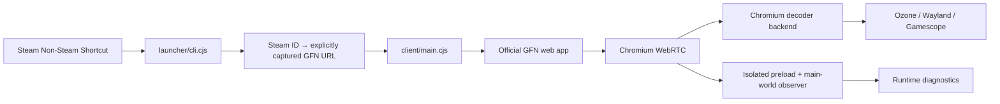

# Architecture and decisions

> Historical architecture snapshot. Current results, catalog/Steam integration,
> and native H.264 evidence: [PoC status dated 2026-10-05](poc-status.md).

Snapshot: 2026-10-04. Target: Odin 2 Portal, Linux aarch64, ArmadaOS.
The repository was initially empty. GFN game launch and controller operation
have since been confirmed on Portal; HEVC Iris decoding through Wayland DMA-BUF
was demonstrated in a separate GStreamer test. Native statistics identify the
GFN H.264 stream at this stage as FFmpeg software decoding; GFN HEVC remains
open. Decoder-adapter options are in [streamer-options.md](streamer-options.md).
The original GFN web app remains the UI; no switch to OpenNOW.

## References and reproducible research snapshot

| Project | Inspected commit | Finding |
|---|---|---|
| [aanze/geforcenow-arm64](https://github.com/aanze/geforcenow-arm64/tree/ba818e4f14f22c4d8c658661f5f79e54022156d3) | `ba818e4f14f22c4d8c658661f5f79e54022156d3` | ARM64-build README; describes software decoding, no independent decoder sources |
| [hmlendea/gfn-electron](https://github.com/hmlendea/gfn-electron/tree/10af7432ff3097a58973496a3f266e294582b483) | `10af7432ff3097a58973496a3f266e294582b483` | Actual Electron upstream; GFN web app, browser controller support, CMS-ID route |
| [armada-os/armada](https://github.com/armada-os/armada/tree/43c0cca880cefbb963d5fdc1554816ffd0a5691f) | `43c0cca880cefbb963d5fdc1554816ffd0a5691f` | Fedora bootc, native ARM64 graphics, Steam/FEX, device DTS and custom packages |

The reference application is GPL-3.0. This implementation was created
independently; no source code or artwork was copied. A project license must be
selected before publication. Electron and other bundled components retain
their license files in the package.

## Modules

- `launcher/`: CLI, TOML configuration, validated URL mappings, device probes.
- `client/`: Electron window, persistent session, Wayland selection, telemetry.
- `steam-integration/`: at this snapshot, a controlled manifest export only.
- `build/` and `scripts/`: pinned inputs, Linux ARM64 container, portable bundle.

Electron 44.5.1 was verified through the npm registry and pinned exactly.
The [Electron 44 release](https://www.electronjs.org/blog/electron-44-0)
uses Chromium 152. Its exact patch version is logged at runtime; assumptions
from another Chromium version are not presented as capabilities.
An Electron wrapper initially avoids a full Chromium build. The hardware path
is a separate research and integration step.

## Launch, login, and controllers

`launch` opens `https://play.geforcenow.com/`; `login` opens the same application
in a window. Official NVIDIA login runs in the persistent profile. Cookies,
IndexedDB, and storage use the separate `persist:gfn` session. Persistence
does not establish that every OAuth provider accepts Electron. Google/Discord
redirects are not enabled at this snapshot; NVIDIA login is the initial test
path. Other providers need targeted validation.

Renderers have no Node access, use sandboxing and context isolation. HTTPS
navigation is limited to GFN and NVIDIA. Popups receive the same secure
WebPreferences and session. Tokens, cookies, SDP, ICE addresses, and complete
navigation URLs are not logged. No remote-control ports are opened.
[Electron security](https://www.electronjs.org/docs/latest/tutorial/security).

With `WAYLAND_DISPLAY` set, Ozone Wayland is requested. Actual output must be
checked through `chrome://gpu`. Turnip is the Vulkan driver; a Chromium GL/EGL
path may instead use Freedreno. Both are independent of the VPU. No speculative
VA-API or zero-copy switches.

GFN receives the Chromium Gamepad API. Telemetry reports controller count,
axes, buttons, and `mapping`; controller IDs are not logged. Steam Input should
output a standard gamepad. Hotplug, focus, analog triggers, stick mappings,
rumble, and Armada's InputPlumber chain need device tests. User interaction may
be required before the first gamepad poll. Desktop navigation and sign-in may
still need touch/keyboard input.

## Game launch and Steam

See [Direct Launch](direct-launch.md). Steam AppIDs are not GFN CMS IDs.
The upstream route is not a documented official API contract. Only
user-captured mappings are opened. `map` plus Ctrl+Shift+P captures the current
streamer route with confirmation and backup; the table starts empty.
No unverified catalog API, automated login clicks, or invented NVIDIA
parameters. Missing mappings produce a clear error.

Steam can launch the portable wrapper directly. At this historical stage,
`shortcuts.vdf` is unchanged. `sync` produces a manifest with name, Steam ID,
launch arguments, and optional artwork metadata. A future importer must
require Steam to be stopped, select the user profile unambiguously, preserve
unknown binary-VDF fields, detect duplicates, and create a restorable backup
with checksum before atomic replacement. Artwork is downloaded only after
verifying its source and mapping. This is outstanding at this snapshot.

## Configuration contract

`codec`, `fps`, `resolution`, and `bitrate` declare preferences. At this stage,
they are **not** sent to NVIDIA and do not alter WebRTC offers; the CLI explains
this. Stream selection is performed in GFN's UI.
`hardware_decode=false` disables accelerated video decoding; `true` lets
Chromium choose and is not a hardware guarantee.
`fullscreen`, `steam_integration`, and `compatibility_user_agent` affect local
behavior. The optional Chrome UA uses the actual Chromium version; it may
influence browser eligibility but does not create codec support. UA Client
Hints may still identify Electron; hardware capabilities are not fabricated.
Unknown TOML keys are rejected.

## Implemented and outstanding

Implemented: minimal client, persistent profile, CLI, explicit mapping
resolution, diagnostics, manifest export, ARM64 packaging, and launcher tests.
Login, GFN gameplay, and Xbox controller recognition have been tested on Portal.
The original GFN H.264 stream at this stage demonstrably uses FFmpeg software
decoding. Outstanding: automatically maintained catalog, robust UI search as an
alternative to changed CMS routes, Steam VDF import, GFN hardware decoding,
and measured low-copy output. If NVIDIA changes its CMS route, the user must
find the title in GFN and capture a new mapping. This manual recovery exists;
automatic DOM search is not implemented.

## Native comparison candidate: OpenNOW (2026-10-04)

The OpenNOW Qt/Rust alternative was investigated. The user subsequently chose
to stay close to the original GFN web client. Electron/Chromium with the
original GFN UI therefore remains the architecture; OpenNOW is not used or
further tested as the client. A comparison package was downloaded and extracted
on Portal, but never started. Source analysis remains a reference.
Source assessment and test plan: [opennow-evaluation.md](opennow-evaluation.md).

## Local decoder bridge (2026-10-04)

The isolated prototype under `experiments/dmabuf` explicitly decodes a synthetic
HEVC clip with GStreamer `v4l2h265dec` on Iris `/dev/video0` and imports NV12
DMA-BUFs through Electron SharedTexture into a sandboxed renderer. Native
Wayland tests confirmed visible content, 60 transfers/draw calls, and complete
buffer release. This application is separate from GFN and excluded from its
package.

The next boundary is to pass compressed frames from the original GFN WebRTC
receiver into a bounded native `appsrc` queue. Initially observe/decode the
actually negotiated H.264 stream in parallel; audio, login, controllers, and
original UI remain in the browser. Replace software decoding only afterwards
and measure audio/video synchronization. HEVC negotiation is a separate open
issue. Details and limits: [test application](../experiments/dmabuf/README.md).

H.264 attachment is now opt-in: encoded transform, validated/bounded IPC,
appsrc/V4L2, and a DMA-BUF diagnostic window. Following a live crash, the decoder
thread, native module, FD import, and diagnostic window run in a separate
Electron helper with a temporary profile. GFN receives only status and sends
compressed frames; the original browser stream stays active. Helper SIGSEGV
isolation was checked on Mac and Portal; the local hardware path in the new
process was demonstrated at 720p for over 30 seconds. An actual GFN stream
needs separate validation. Color errors and the original crash cause are not
fixed by isolation. The helper uses Wayland; the GFN frontend can remain on
XWayland. [Bridge architecture and activation](native-bridge.md).
