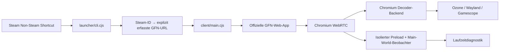

# Architektur und Entscheidungen

Stand: 2026-10-04. Ziel: Odin 2 Portal, Linux aarch64, ArmadaOS.
Das Repository war bei Beginn leer. Inzwischen sind GFN-Spielstart und
Controller auf dem Portal bestätigt; HEVC-Iris-Decoding ist in einem getrennten
GStreamer-Test nachgewiesen. Hardwaredecode im GFN-Stream bleibt unbestätigt.
Die aktuellen Decoderadapter-Optionen stehen in
[streamer-options.md](streamer-options.md). Die originale GFN-Web-App bleibt
die Oberfläche; kein Wechsel zum OpenNOW-Client.

## Referenzen und reproduzierbarer Forschungsstand

| Projekt | untersuchter Commit | Befund |
|---|---|---|
| [aanze/geforcenow-arm64](https://github.com/aanze/geforcenow-arm64/tree/ba818e4f14f22c4d8c658661f5f79e54022156d3) | `ba818e4f14f22c4d8c658661f5f79e54022156d3` | README eines ARM64-Builds; beschreibt Software-Decoding, kein eigenständiger Decoder-Quellcode |
| [hmlendea/gfn-electron](https://github.com/hmlendea/gfn-electron/tree/10af7432ff3097a58973496a3f266e294582b483) | `10af7432ff3097a58973496a3f266e294582b483` | tatsächlicher Electron-Upstream; GFN-Web-App, Controller über Browser, CMS-ID-Route |
| [armada-os/armada](https://github.com/armada-os/armada/tree/43c0cca880cefbb963d5fdc1554816ffd0a5691f) | `43c0cca880cefbb963d5fdc1554816ffd0a5691f` | Fedora bootc, native ARM64-Grafik, Steam/FEX, Geräte-DTS und eigene Pakete |

Die Referenzanwendung ist GPL-3.0. Die neue Implementierung wurde eigenständig
angelegt; kein Quellcode oder Artwork wurde kopiert. Eine Projektlizenz muss vor
Veröffentlichung gewählt werden. Electron und weitere gebündelte Komponenten
behalten ihre Lizenzdateien im Paket.

## Module

- `launcher/`: CLI, TOML-Konfiguration, geprüfte URL-Zuordnung, Geräteprobes.
- `client/`: Electron-Fenster, persistente Session, Wayland-Auswahl und Telemetrie.
- `steam-integration/`: aktuell ausschließlich ein kontrollierter Manifestexport.
- `build/` und `scripts/`: gepinnte Inputs, Linux-ARM64-Container und portables Bundle.

Electron 44.5.1 wurde über die npm-Registry verifiziert und exakt gepinnt.
Die [Electron-44-Veröffentlichung](https://www.electronjs.org/blog/electron-44-0)
verwendet Chromium 152. Die konkrete Patchversion wird zur Laufzeit protokolliert;
es werden keine Annahmen aus einer anderen Chromium-Version als Fähigkeit verkauft.
Ein Electron-Wrapper spart zunächst einen vollständigen Chromium-Build. Der
Hardwarepfad ist ein separater Untersuchungs- und Integrationsschritt.

## Start, Login und Controller

`launch` öffnet `https://play.geforcenow.com/`, `login` dieselbe Anwendung im Fenster.
Das offizielle NVIDIA-Login läuft innerhalb des persistenten Profils. Cookies,
IndexedDB und Storage liegen im separaten `persist:gfn`-Sessionbereich. Session-
Persistence ersetzt keine Prüfung, ob ein bestimmter OAuth-Provider Electron
akzeptiert. Google/Discord-Weiterleitungen sind aktuell nicht freigegeben; NVIDIA-
Login ist der erste Testpfad. Weitere Provider brauchen eine gezielte Prüfung.

Renderer haben kein Node, sind sandboxed und context-isolated. HTTPS-Navigation
bleibt auf GFN und NVIDIA beschränkt. Popups erhalten dieselben sicheren
WebPreferences und dieselbe Session. Es werden keine Token, Cookies, SDP, ICE-
Adressen oder vollständigen Navigations-URLs geloggt. Keine Fernsteuerungsports
werden geöffnet. [Electron-Sicherheit](https://www.electronjs.org/docs/latest/tutorial/security).

Bei gesetztem `WAYLAND_DISPLAY` wird Ozone Wayland angefordert. Die tatsächlich
verwendete Ausgabe muss mit `chrome://gpu` überprüft werden. Turnip ist der Vulkan-
Treiber; ein Chromium-GL/EGL-Pfad kann stattdessen Freedreno verwenden. Beides ist
von der VPU unabhängig. Keine VA-API- oder Zero-Copy-Schalter auf Verdacht.

GFN erhält die Chromium Gamepad API. Telemetrie zeigt Controller-Anzahl, Achsen,
Buttons und `mapping`; eine Controller-ID wird nicht geloggt. Steam Input soll ein
Standard-Gamepad ausgeben. Hotplug, Fokus, analoge Trigger, Stickbelegung, Rumble
und die Armada-InputPlumber-Kette sind auf dem Gerät zu prüfen. Vor dem ersten
Gamepad-Poll kann eine Benutzerinteraktion notwendig sein. Desktop-Navigation
und Anmeldung können weiterhin Touch/Tastatur benötigen.

## Spielstart und Steam

Siehe [Direct Launch](direct-launch.md). Steam-AppIDs sind keine GFN-CMS-IDs.
Die im Upstream gefundene Route ist kein dokumentierter offizieller API-Vertrag.
Nur vom Benutzer erfasste Zuordnungen werden geöffnet. `map` plus Ctrl+Shift+P
erfasst eine aktuell geöffnete Streamer-Route mit Bestätigung und Backup. Die Tabelle startet leer.
Keine ungesicherte Katalog-API, keine automatischen Login-Klicks, keine erfundenen
NVIDIA-Parameter. Fehlende Zuordnungen ergeben einen klaren Fehler.

Steam kann das portable Wrapper-Script direkt starten. Aktuell wird kein
`shortcuts.vdf` verändert. `sync` erzeugt ein Manifest mit Name, Steam-ID,
Launch-Argumenten und optionalem Artwork-Metadatenobjekt. Eine spätere Import-
Implementierung muss Steam beenden lassen, Benutzerprofil eindeutig wählen,
Binary-VDF unbekannte Felder erhalten, Duplikate erkennen und vor atomarem
Ersetzen ein rückspielbares Backup inklusive Prüfsumme anlegen. Artwork wird
erst nach überprüfter Quelle und Zuordnung heruntergeladen. Das ist noch offen.

## Konfigurationsvertrag

`codec`, `fps`, `resolution`, `bitrate` sind deklarierte Wünsche. Sie werden
**nicht** an NVIDIA übertragen und verändern keine WebRTC-Angebote. Die CLI
weist darauf hin. Die Streamauswahl erfolgt aktuell in der GFN-UI.
`hardware_decode=false` deaktiviert beschleunigtes Video-Decoding;
`true` lässt Chromium wählen und ist keine Hardwaregarantie.
`fullscreen`, `steam_integration` und `compatibility_user_agent` haben lokale
Wirkung. Die optionale Chrome-UA nutzt die tatsächliche Chromium-Version; sie
kann die Browserzulassung beeinflussen, schafft aber keine Codecunterstützung.
UA Client Hints können weiterhin Electron erkennen; kein manipulierter
Hardwarefähigkeitsbericht. Unbekannte TOML-Schlüssel führen zu einem Fehler.

## Erreicht und offen

Implementiert: minimaler Client, persistentes Profil, CLI, explizite Mapping-
Auflösung, Diagnostik, Manifestexport, ARM64-Paketierung und Launcher-Tests.
Offen: echte Login-/Streamtests, Gerätecontroller, automatisch gepflegter
Katalog, robuste UI-basierte Suche als Alternative zu geänderter CMS-Route,
Steam-VDF-Import, Hardware-Decoding und nachgewiesene Low-Copy-Ausgabe.
Wenn NVIDIA die CMS-Route ändert, muss der Nutzer den Titel in der GFN-Oberfläche
suchen und die Zuordnung neu erfassen. Dieser manuelle Rückweg ist verfügbar;
eine automatische DOM-Suche ist noch nicht implementiert.
# Nativer Vergleichskandidat: OpenNOW (2026-10-04)

Die OpenNOW-Qt/Rust-Alternative wurde untersucht. Der Nutzer hat anschließend
festgelegt, möglichst nahe am originalen GFN-Webclient zu bleiben. Deshalb
bleibt Electron/Chromium mit originaler GFN-Weboberfläche die gewählte
Architektur; OpenNOW wird nicht als Client eingesetzt oder weiter getestet.
Es wurde lediglich ein Vergleichspaket heruntergeladen und auf dem Portal
entpackt, nicht gestartet. Die Quellanalyse bleibt als Referenz erhalten.
Quellbewertung und Testplan: [opennow-evaluation.md](opennow-evaluation.md).
