# Lightweight video path with the original GFN UI

Status on 2026-10-04. The user wants login, catalog and interaction to remain
close to original GFN. A custom streamer is permitted; switching to the OpenNOW
UI is not planned. None of the alternatives below had yet been validated as a
GFN HEVC solution on Iris. This is a historical investigation; later results
are in [the project summary](project-summary-2026-10-05.md).

## Decision for the next experiment

The existing Electron application remains the working comparison client.
First test the new native decoder diagnostics in a real GFN game. Then investigate
a **GStreamer decoder adapter** as a bounded experiment before replacing all
session setup or building Chromium.

The promising path retains GFN WebRTC for connection, audio and input:

```mermaid
flowchart LR
  GFN[Original GFN web app] --> RTC[Chromium WebRTC]
  RTC --> Encoded[Compressed video frames]
  Encoded --> Bridge[Bounded native decoder bridge]
  Bridge --> GST[GStreamer appsrc + parser + stateful V4L2]
  GST --> Iris[Qualcomm Iris]
  Iris --> DMA[DMA-BUF]
  DMA --> Texture[Electron nativePixmap / SharedTexture]
  Texture --> Canvas[VideoFrame / GPU canvas]
  Canvas --> Screen[Original client window]
```

This is a design to investigate, not an implemented pipeline at this stage.
No encoded frames from a real GFN session had yet been captured.

## Established by primary sources and tests

The [WebRTC Encoded Transform API](https://www.w3.org/TR/webrtc-encoded-transform/)
sits between receiver depacketizer and decoder. It exposes compressed frames,
but alone neither replaces a decoder nor adds missing codecs to SDP negotiation.

`tests/smoke-encoded-transform.cjs` passes on Apple Silicon with Electron 44.5.1:
30 H.264 frames, 32,304 bytes, one keyframe, all 30 with Annex-B start codes;
49 video frames displayed during measurement. The worker forwards originals
unchanged. Only counters are exported; no image data saved. This establishes
the API in a local synthetic stream, not GFN CSP, other codec frame formats
or compatibility with GFN streamer logic.

The same test passes on the Portal: 30 frames / 32,766 bytes, 43 displayed frames.
A separate local HEVC test demonstrates Iris → NV12 DMA-BUF → Wayland `wl_buffer`;
see [odin-device-validation.md](odin-device-validation.md). The actual GFN H.264
stream has meanwhile been identified by the reader as FFmpeg software decode.
The local decoder foundation and browser gap are therefore separate findings.

Electron 44.5.1 provides Linux DMA-BUF plane import:
[SharedTextureHandle](https://github.com/electron/electron/blob/v44.5.1/docs/api/structures/shared-texture-handle.md)
describes `nativePixmap` with FD, stride, offset, size and modifier;
the [implementation](https://github.com/electron/electron/blob/v44.5.1/shell/common/api/electron_api_shared_texture.cc)
duplicates FDs into `NativePixmapPlane` and imports the SharedImage.
[SharedTexture API](https://github.com/electron/electron/blob/v44.5.1/docs/api/shared-texture.md)
requires resources to remain valid until `allReferencesReleased`. A small native
adapter is therefore plausible; assuming Linux cannot import external textures
is unjustified. Iris NV12, modifiers, fences and transfer to sandboxed preload
had not yet been tested.

## Specific adapter limits

1. GFN must allow timely receiver instrumentation. Check CSP, existing transforms
   and worker lifetime; do not disable sandbox/web security to force an experiment.
2. Compressed frames need a bounded queue and explicit session generation. IPC
   initially copies compressed bytes, not raw video frames. Measure byte copies
   and queue latency rather than claiming zero-copy for the whole path.
3. Test `appsrc ! h264parse ! v4l2h264dec` locally first, then HEVC similarly.
   Select the decoder explicitly; no `decodebin` silently choosing software.
4. Switch to GPU canvas only after DMA-BUF import is validated. FD ownership,
   buffer return, resolution changes and GPU completion must be correct; reused
   CAPTURE buffers must not overwrite a visible image.
5. An initial parallel path observes/decodes frames without saving CPU. Skip
   Chromium decode only later. Check whether GFN runs without its own decoded
   video frames and preserves overlay, focus, controller, video time and audio sync.
6. Resume browser decoding cleanly from a new keyframe after errors; do not
   report success when only audio or a stale image remains.

**HEVC is separate:** the current Linux binary does not offer H.265 in its WebRTC
capabilities. An external HEVC decoder alone does not change that. If NVIDIA
provides no HEVC to this web session, the adapter initially ends at real H.264
hardware decode. HEVC could require a small native WebRTC decoder-factory connection
or streamer replacement. Investigate AV1 only after a validated HEVC/device path.

## Other routes and why they were not adopted

| Route | What remains original? | Result / missing component |
|---|---|---|
| Fedora Chromium app mode | Entire GFN web app and WebRTC | Existing ARM64 binary tested; FFmpeg fallback, empty decode profiles. Further device probe needed |
| Small Chromium/Electron V4L2 patch | Entire web app, transport, video elements | Cleanest browser integration; build and stateful HEVC gap require work |
| GStreamer `webrtcbin` behind a web API adapter | GFN UI, login and session creation could remain | RTCPeerConnection, ICE, SDP, SCTP/input and presentation need compatible adapters; not drop-in |
| Native NVST streamer | Web login/catalog could remain | WebRTC sessions are not automatically native NVST sessions; handoff/protocol compatibility needs proof |
| WebKitGTK / WPE | Original website in another engine | GFN/input compatibility untested; current WPE 2.54 disables WebRTC |

[NEXTCLIENT](https://github.com/clarkarch/nextclient/tree/5989551cc8ab1042c7bf86723d92b9084192501d)
was investigated as a streamer reference, not selected as a new UI. Its
[GStreamer C bridge](https://github.com/clarkarch/nextclient/blob/5989551cc8ab1042c7bf86723d92b9084192501d/native/gst_bridge/gst_bridge.c)
shows offer/answer, ICE and data-channel integration. It uses custom GFN session
logic, `decodebin` and VA-API/VAMemory for the GPU path; the
[C ABI](https://github.com/clarkarch/nextclient/blob/5989551cc8ab1042c7bf86723d92b9084192501d/native/gst_bridge/gst_bridge.h)
also has a CPU RGBA callback. It is not a complete Iris adapter. No code copied,
installation or login performed.

OpenNOW remains solely the documented NVST reference. Moonlight/GameStream use
other server/session protocols and are not demonstrated GFN streamer replacements.

[WPE 2.54 release notes](https://wpewebkit.org/blog/2026-09-16-wpewebkit-2.54.html)
describe WebRTC disabled during a backend transition. Qualcomm support through
`qtic2vdec` does not establish Armada's Iris V4L2 path. No engine switch on that basis.

## Next device test at this stage

Portal access failed during the experimental blocklist comparison; its result
remains missing, with no established browser-related cause. After SSH recovery,
the reader in original GFN and the Linux Encoded Transform test passed. Next:
GStreamer adapter with synthetic frames and Electron DMA-BUF import, then real
GFN encoded-frame access. Do not fake an HEVC offer through flags.

### Update: DMA-BUF import confirmed on the Portal

The isolated [GStreamer/Node-API prototype](../experiments/dmabuf/README.md) is
implemented and validated under native Wayland with an HEVC clip. Iris provides
1280×736 NV12 CAPTURE buffers with visible 1280×720 pixels. Electron 44.5.1
imports two linear DMA-BUF planes and displays the pattern in a GPU canvas.
Renderer remains sandboxed; 60 transfers/draw calls, all 60 leases released.
Screenshot/pixel readbacks are checks only. No raw pixel copy in the addon,
but no measurement of all internal GPU/compositor copies.

XWayland comparisons failed on SharedImage backing; the last also reported
software GPU features. Use Wayland as the demonstrated path and do not report
XWayland supported. The precise comparison failure cause is not isolated.
`ExtSamplerOff` alone does not justify a format patch: the same NV12 import
works under Wayland without one. Check GPU features after initialization.

Next: `appsrc` with local compressed H.264 frames, then isolated observation
of a real GFN Encoded Transform. Connect its output to the native queue only
after that proof. The initial parallel path saves no CPU; replace software decode
only with working error handling/audio sync. HEVC negotiation is separate;
AV1 remains lower priority.

### Update: H264 connection implemented

`GFN_ARMADA_NATIVE_SHADOW=1` connects the original GFN receiver to the native
appsrc bridge. Worker preflight, codec/keyframe gate, bounded queues and a separate
decoder thread are implemented. Originals are forwarded. Real local Mac WebRTC
tap/fallback tests pass; a real Portal/GFN stream is not yet validated at this
stage. See [native-bridge.md](native-bridge.md). No software-decode replacement
or HEVC offer to NVIDIA yet.
