# Schlanker Videopfad mit originaler GFN-Oberfläche

Stand 2026-10-04. Der Nutzer möchte Login, Katalog und Bedienung möglichst nah
am originalen GFN halten. Ein eigener Streamer ist erlaubt, ein Wechsel zur
OpenNOW-Oberfläche ist nicht vorgesehen. Keine hier untersuchte Alternative
ist bislang als HEVC-GFN-Lösung auf Iris validiert.

## Entscheidung für den nächsten Versuch

Die bestehende Electron-Anwendung bleibt der funktionierende Vergleichsclient.
Zuerst die neue native Decoderdiagnose in einem echten GFN-Spiel prüfen.
Danach einen **Decoderadapter mit GStreamer** als begrenzten Versuch untersuchen,
bevor der gesamte Sitzungsaufbau oder ein Chromium-Build ersetzt wird.

Der vielversprechende Pfad behält GFN-WebRTC für Verbindung, Audio und Eingaben:

```mermaid
flowchart LR
  GFN[Originale GFN-Web-App] --> RTC[Chromium WebRTC]
  RTC --> Encoded[Komprimierte Video-Frames]
  Encoded --> Bridge[Begrenzte native Decoderbrücke]
  Bridge --> GST[GStreamer appsrc + Parser + stateful V4L2]
  GST --> Iris[Qualcomm Iris]
  Iris --> DMA[DMA-BUF]
  DMA --> Texture[Electron nativePixmap / SharedTexture]
  Texture --> Canvas[VideoFrame / GPU-Canvas]
  Canvas --> Screen[Originales Clientfenster]
```

Das ist ein zu prüfender Entwurf, keine implementierte Pipeline. Insbesondere
ist noch kein Encoded-Frame aus einer echten GFN-Sitzung abgegriffen worden.

## Was bereits mit Primärquellen und Tests belegt ist

Die [WebRTC Encoded Transform API](https://www.w3.org/TR/webrtc-encoded-transform/)
liegt auf Empfangsseite zwischen Depacketizer und Decoder. Sie erlaubt Zugriff
auf komprimierte Frames, ersetzt aber allein keinen Decoder und fügt keinen
fehlenden Codec zur SDP-Verhandlung hinzu.

`tests/smoke-encoded-transform.cjs` besteht auf Apple Silicon mit Electron 44.5.1:
30 H.264-Frames, 32.304 Bytes, ein Keyframe, alle 30 mit Annex-B-Startcode;
49 Video-Frames werden während der Messung angezeigt. Der Worker gibt die
Originalframes unverändert weiter. Es werden nur Zähler exportiert, keine
Bilddaten gespeichert. Dieser Test belegt die API im lokalen synthetischen
Stream, nicht die GFN-Content-Security-Policy, Frameformate anderer Codecs oder
die Kompatibilität der GFN-Streamerlogik.

Derselbe Test besteht auf dem Portal mit 30 Frames / 32.766 Bytes und
43 angezeigten Frames. Ein zusätzlicher lokaler HEVC-Test belegt dort Iris →
NV12-DMA-BUF → Wayland-`wl_buffer`; Details in
[odin-device-validation.md](odin-device-validation.md). Der tatsächliche
GFN-H.264-Stream wurde inzwischen mit dem Reader als FFmpeg-Softwaredecode
identifiziert. Damit sind die lokale Decoderbasis und die Browserlücke getrennt.

Electron 44.5.1 bietet tatsächlich einen Linux-Import für DMA-BUF-Planes:
[SharedTextureHandle](https://github.com/electron/electron/blob/v44.5.1/docs/api/structures/shared-texture-handle.md)
beschreibt `nativePixmap` mit FD, Stride, Offset, Größe und Modifier;
[Implementierung](https://github.com/electron/electron/blob/v44.5.1/shell/common/api/electron_api_shared_texture.cc)
dupliziert die FDs in `NativePixmapPlane` und importiert das SharedImage.
[SharedTexture API](https://github.com/electron/electron/blob/v44.5.1/docs/api/shared-texture.md)
fordert, dass die Ressource bis `allReferencesReleased` gültig bleibt.
Damit ist ein kleiner nativer Adapter plausibler als eine Annahme, externe
Texturen seien unter Linux prinzipiell nicht importierbar. Iris-NV12, Modifier,
Fences und der Transfer zum sandboxed Preload sind jedoch noch nicht getestet.

## Konkrete Grenzen des Decoderadapters

1. Die GFN-Seite muss einen Empfänger rechtzeitig instrumentieren lassen.
   CSP, vorhandene Transform-Nutzung und Worker-Lebensdauer prüfen; keine
   Sandbox oder Web-Security abschalten, um ein Experiment zu erzwingen.
2. Eine gebundene Queue für komprimierte Frames und eindeutige Sessiongeneration
   sind nötig. IPC kopiert zunächst komprimierte Bytes, keine rohen Videoframes.
   Bytekopien und Queue-Latenz messen, statt Zero-Copy für den ganzen Pfad zu behaupten.
3. `appsrc ! h264parse ! v4l2h264dec` zunächst lokal prüfen, danach HEVC analog.
   Decoder explizit wählen; kein `decodebin`, das unbemerkt Software auswählt.
4. Erst nach validiertem DMA-BUF-Import auf eine GPU-Canvas-Ausgabe umstellen.
   FD-Besitz, Pufferrückgabe, Auflösungswechsel und GPU-Fertigstellung müssen
   stimmen; ein wiederverwendeter CAPTURE-Puffer darf kein sichtbares Bild überschreiben.
5. Ein erster Doppelpfad kann Frames beobachten und parallel decodieren,
   spart aber noch keine CPU. Erst später Chromium-Decoding auslassen.
   Prüfen, ob GFN ohne eigene decodierte Video-Frames weiterläuft, ob Overlay,
   Fokus, Controller, Videozeit und Audio-Synchronität erhalten bleiben.
6. Bei Fehlern Browser-Decoding über ein neues Keyframe sauber fortsetzen;
   die Sitzung nicht als erfolgreich melden, wenn nur Audio oder ein altes Bild läuft.

**HEVC bleibt separat:** das jetzige Linux-Binary bietet kein H.265 in seinen
WebRTC-Fähigkeiten. Ein externer HEVC-Decoder ändert das nicht. Falls NVIDIA
dieser Webclient-Sitzung kein HEVC liefert, endet der Decoderadapter zunächst
bei echtem H.264-Hardwaredecode. Für HEVC kann zusätzlich eine kleine native
WebRTC-Decoderfabrik-Anbindung oder ein Streamerersatz nötig werden. AV1 erst
nach validiertem HEVC-/Gerätepfad untersuchen.

## Andere Wege und warum sie noch nicht übernommen werden

| Weg | Was bleibt original? | Ergebnis / fehlende Komponente |
|---|---|---|
| Fedora-Chromium im App-Modus | gesamte GFN-Web-App und WebRTC | fertiges ARM64-Binary getestet, bisher FFmpeg-Fallback; Decodeprofile leer. Weitere Geräteprobe nötig |
| kleiner Chromium/Electron-V4L2-Patch | gesamte Web-App, Transport, Videoelemente | sauberste Browserintegration; Build und stateful HEVC-Lücke bleiben Aufwand |
| GStreamer `webrtcbin` hinter Web-API-Adapter | GFN-Oberfläche, Login und Sitzungserstellung könnten bleiben | RTCPeerConnection, ICE, SDP, SCTP/Input und Videoausgabe müssen kompatibel adaptiert werden; kein Drop-in-Ersatz |
| nativer NVST-Streamer | Web-Login/Katalog könnten bleiben | WebRTC-Session ist nicht automatisch eine native NVST-Session; Übergabe und Protokollkompatibilität erst belegen |
| WebKitGTK / WPE | originale Webseite in anderer Engine | GFN-/Input-Kompatibilität ungeprüft; aktuelles WPE 2.54 deaktiviert WebRTC |

[NEXTCLIENT](https://github.com/clarkarch/nextclient/tree/5989551cc8ab1042c7bf86723d92b9084192501d)
wurde als Streamerreferenz untersucht, nicht als neue Oberfläche ausgewählt.
Sein [GStreamer-C-Bridge](https://github.com/clarkarch/nextclient/blob/5989551cc8ab1042c7bf86723d92b9084192501d/native/gst_bridge/gst_bridge.c)
zeigt offer/answer, ICE und Data-Channel-Anbindung. Er verwendet eigene
GFN-Sitzungslogik, `decodebin` und für den GPU-Pfad VA-API/VAMemory; der
[C-ABI](https://github.com/clarkarch/nextclient/blob/5989551cc8ab1042c7bf86723d92b9084192501d/native/gst_bridge/gst_bridge.h)
hat außerdem einen CPU-RGBA-Callback. Das ist kein fertiger Iris-Adapter.
Keine Codeübernahme, Installation oder Anmeldung erfolgt.

OpenNOW bleibt ausschließlich die bereits dokumentierte NVST-Referenz.
Moonlight/GameStream sind andere Server-/Sitzungsprotokolle und kein belegter
GFN-Streamerersatz.

[WPE 2.54 Releasehinweise](https://wpewebkit.org/blog/2026-09-16-wpewebkit-2.54.html)
beschreiben deaktiviertes WebRTC während des Backendwechsels. Die dort genannte
Qualcomm-Unterstützung über `qtic2vdec` belegt nicht den auf Armada verfügbaren
Iris-V4L2-Pfad. Deshalb jetzt kein Browserengine-Wechsel auf diese Basis.

## Nächster Gerätetest

Der Portalzugriff brach während des experimentellen Blocklistenvergleichs
ab; dessen Ergebnis fehlt weiterhin, ein ursächlicher Zusammenhang mit dem
Browser wurde nicht festgestellt. Nach Wiederherstellung von SSH wurden
der Reader im originalen GFN-Client und der Linux-Encoded-Transform-Test
erfolgreich geprüft. Der nächste Schritt ist der GStreamer-Adapter mit
synthetischen Frames und Electron-DMA-BUF-Import, anschließend der echte
GFN-Encoded-Framezugriff. Kein HEVC-Angebot durch Flags vortäuschen.

### Update: DMA-BUF-Import auf dem Portal bestätigt

Der isolierte [GStreamer-/Node-API-Prototyp](../experiments/dmabuf/README.md)
ist implementiert und unter nativem Wayland mit einem HEVC-Testclip validiert.
Iris liefert 1280×736-NV12-Capturebuffer mit sichtbaren 1280×720 Pixeln.
Electron 44.5.1 importiert die zwei linearen DMA-BUF-Planes und stellt das
Testmuster im GPU-Canvas dar. Der Renderer bleibt sandboxed; 60 Transfers
und Draw-Aufrufe, alle 60 Sample-Leases freigegeben. Die Screenshot-/Pixel-
Readbacks dienen ausschließlich der Prüfung. Keine Rohpixelkopie im Addon,
aber keine Messung aller internen GPU-/Compositor-Kopien.

XWayland-Vergleiche scheiterten am SharedImage-Backing; der letzte meldete
zusätzlich Software-GPU-Features. Deshalb Wayland als nachgewiesenen Pfad
verwenden und XWayland nicht als unterstützt melden. Die genaue Ursache
dieses Vergleichsfehlers ist noch nicht isoliert. `ExtSamplerOff` im Fehler
allein rechtfertigt keinen Formatpatch: derselbe NV12-Import klappt unter
Wayland ohne Patch. GPU-Features müssen nach Initialisierung geprüft werden.

Jetzt folgt `appsrc` mit komprimierten lokalen H.264-Frames, anschließend
die isolierte Beobachtung eines echten GFN-Encoded-Transforms. Erst nach
diesem Nachweis dessen Ausgabe an die native Queue anbinden. Ein anfänglicher
Doppelpfad spart noch keine CPU; Softwaredecode erst mit funktionierender
Fehlerbehandlung und Audio-Synchronisation ersetzen. HEVC-Negotiation bleibt
eine eigene Grenze und AV1 weiterhin nachrangig.
